# A Late Fusion CNN for Digital Matting

-----

This is the github project for our paper __A Late Fusion CNN for Digital Matting__.

We provide the supplementary material of our paper here.

Sorry for the inconvience but due to Alibaba's policy we cannot share our human matting dataset currently.

## Code, Model & Clarification

You can download the code and model at https://1drv.ms/u/s!AuG441T6ysq5gytUc8LNhwv-MlqY?e=n0cpaU

**Please note: In our paper, we used two different datasets: DIM dataset and our human matting dataset.**

**The model we released is trained on DIM dataset's TRAIN split and finetuned on our human matting dataset's TRAIN split, which consists of DIM human images in the DIM training split + collected training human images.**

**The state in previous version of background matting paper in CVPR2020(arXiv: 2004.00626) Section 4.1: 'as the released model was trained on all of the Adobe data, including the test data used here (confirmed by the authors)' is not true.**

**We thank the authors ofbackground matting paper in CVPR2020(arXiv: 2004.00626) for the quick correction. The arXiv paper should be updated soon.**

## More test cases & Limitation

Our human matting dataset mostly consists of portrait-type images (upper body). 
About fifth of the images has upper body + around 2/3 of lower body, and only few images has full human body. All of the images are near front view images.

We provide more test cases here and analyse the limitation of our released model.

### Good cases

For most images that are simliar to the image setting in our dataset, with relatively salient foreground object, our model could perform well.

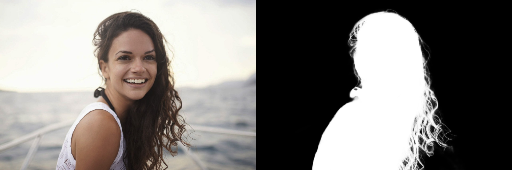

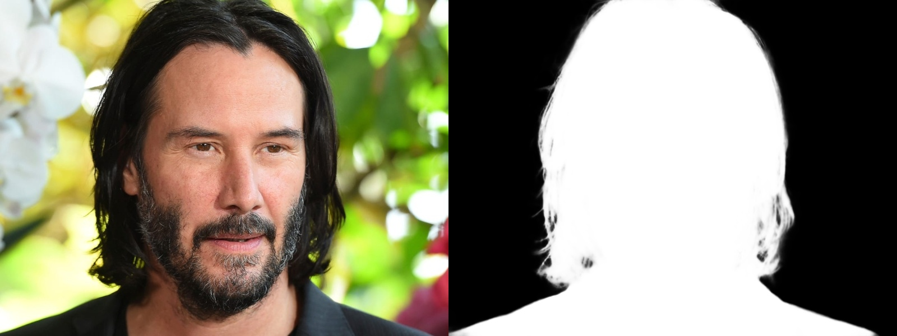

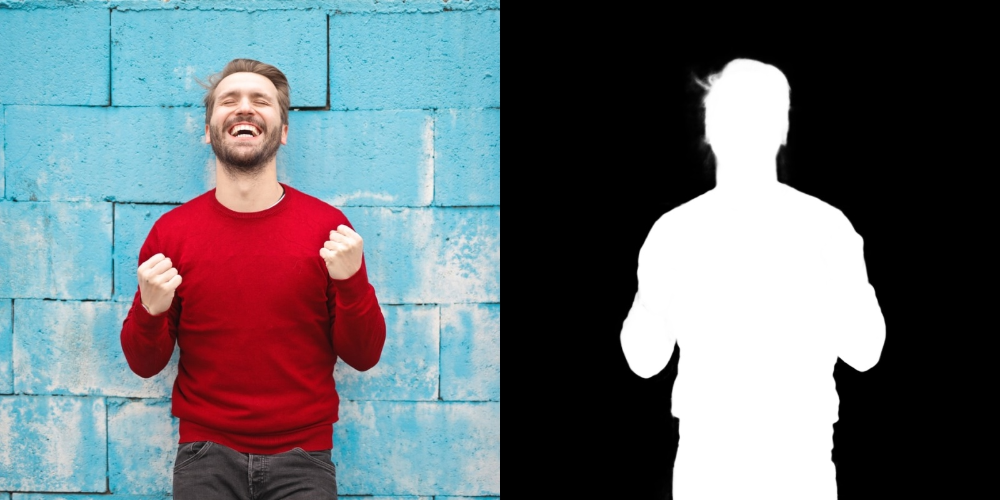

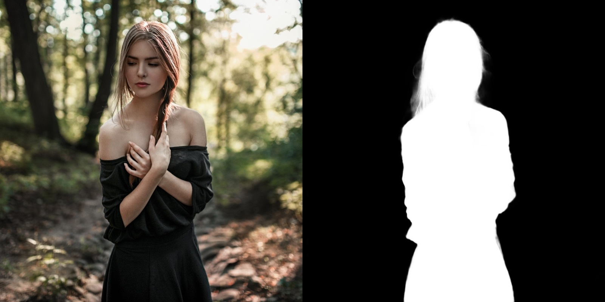

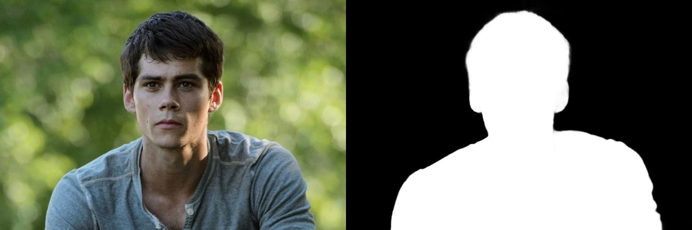

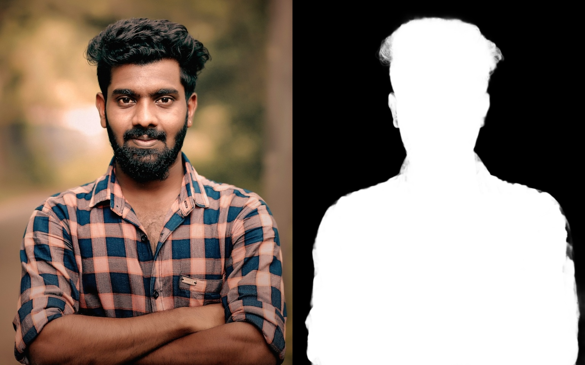

### Influence of rotation and salient object ratio

Although we used rotation and cropping as our data augmentation, due to insuffcient sampling (we use -15 to +15 degrees of random rotation, and 512\*512, 800\*800 for cropping), our model is still not very robust to rotation and foregound object's scale.

Also, due to the lack of full body training data, it is also difficult for the model to well handle this kind of images.

#### Rotation

By rotating the image to the straight position, the model performs better.

**Before rotation**

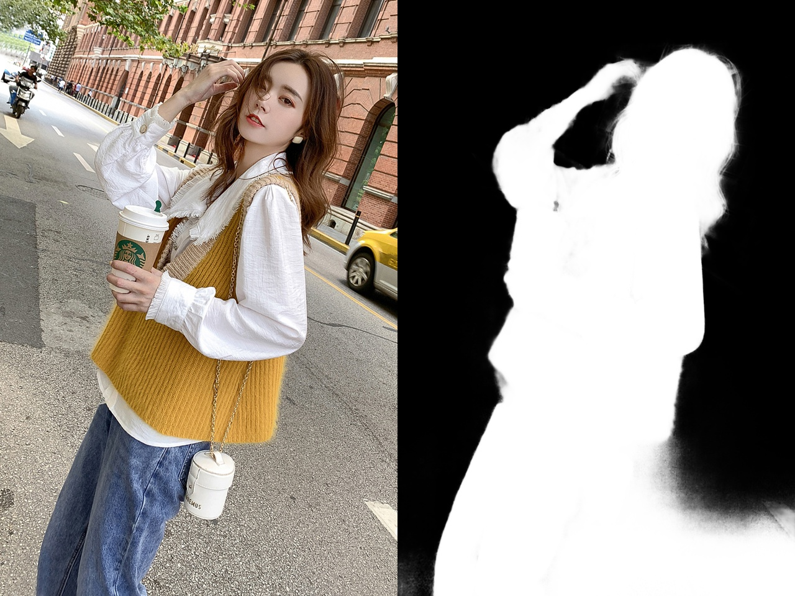

**After rotation**

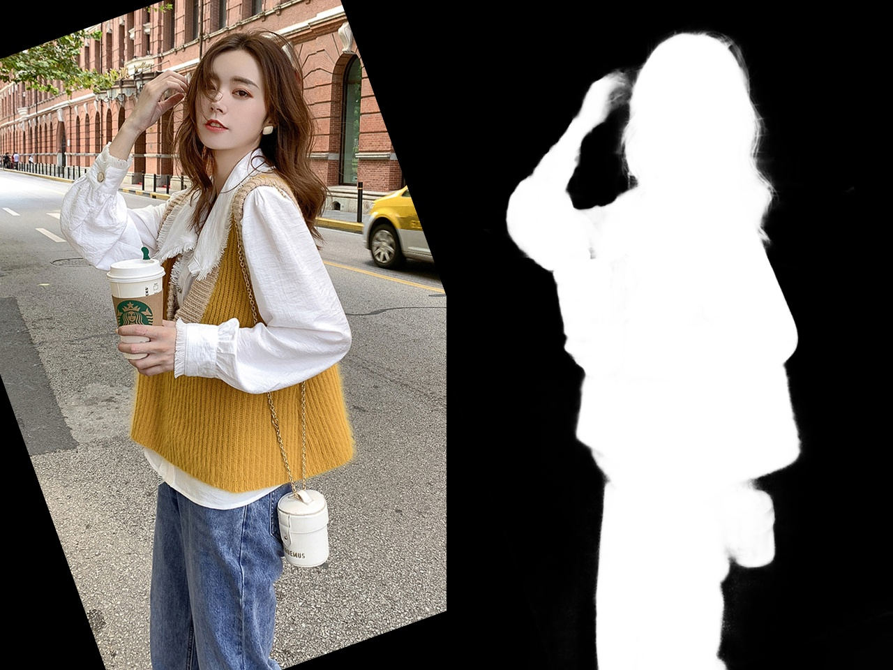

#### Crop

By cropping the image (keep the foregound object's scale relatively large), the model performs better.

**Before cropping**

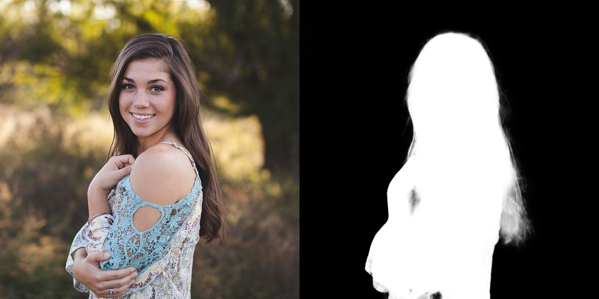

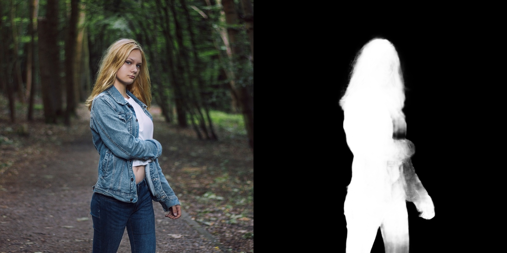

**After cropping**

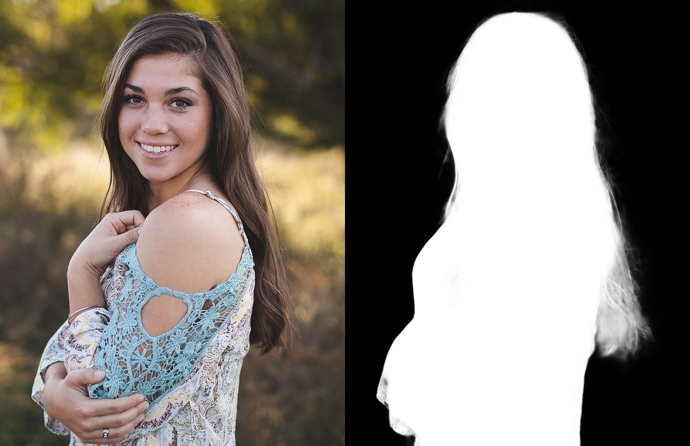

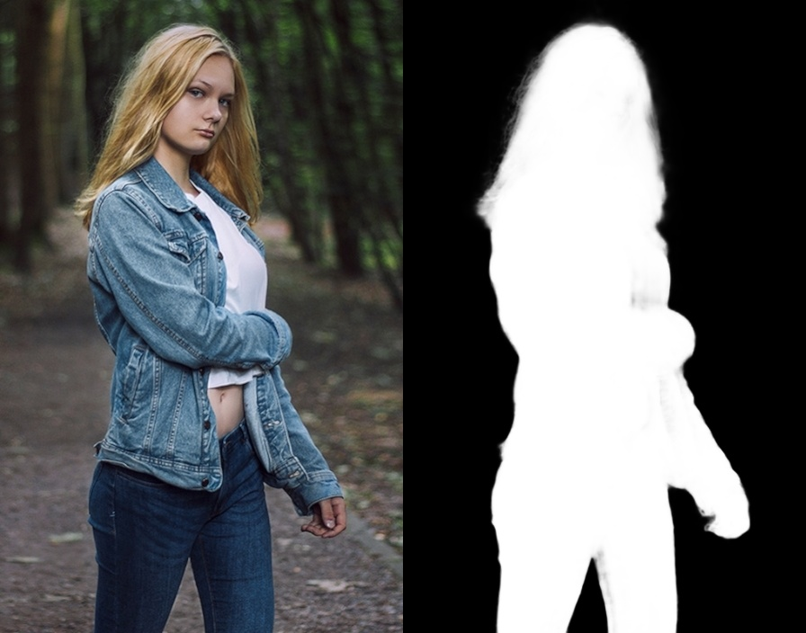

#### Full Body

Since the training images are created by blending the foreground and background images, the foregound objects in training images usually looks separate from the background. In addition, we don't have full body images in our training dataset. Thus, for the case shown below, our model gives a bad result:
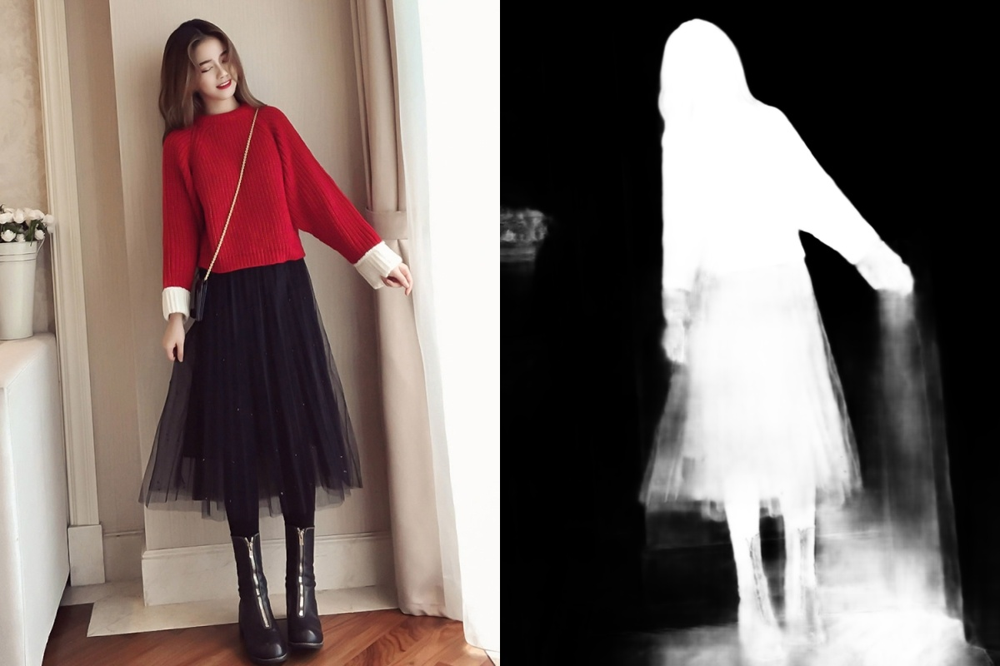

## Test on Background Matting Images

First we want to thank the authors of background matting paper in CVPR2020 for providing the test images. 

The images provided by the authors of CVPR 2020 background matting paper are of size 512\*512 without keeping the aspect ratio. Thus, we resized them back to resonable aspect ratio before inference.

Our test result is consistent with the background matting paper except the photo in Fig.6(b) in the paper (`bgm_images/135_org.png`). The different size of the image the might be the reason of the different performance.

We'll test the original images once the test videos are released.

### Good cases

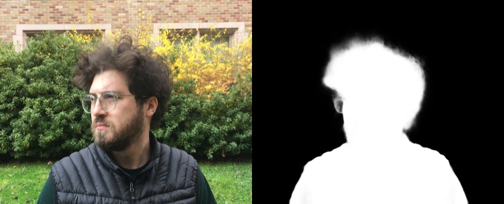

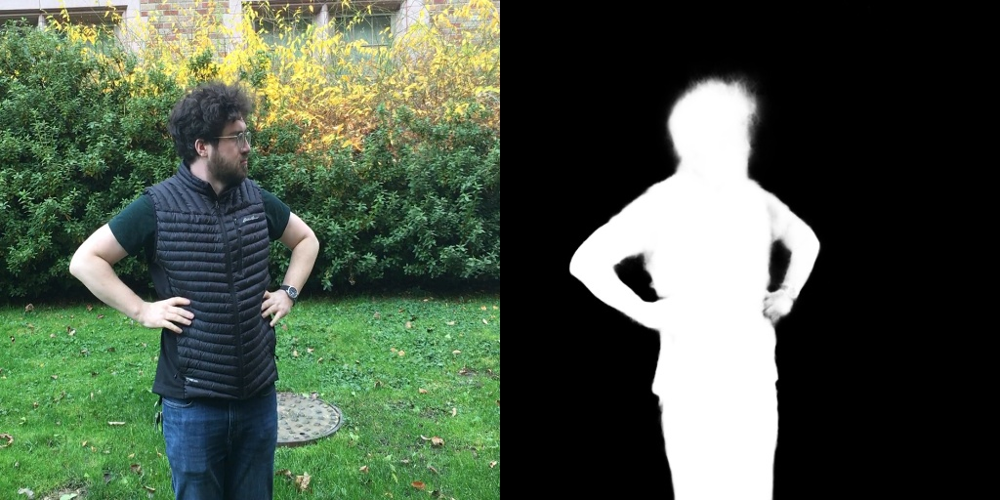

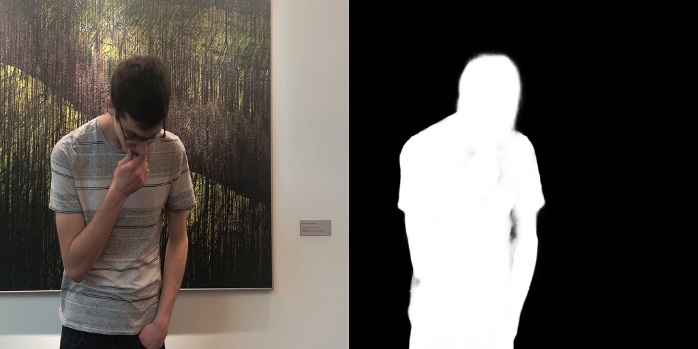

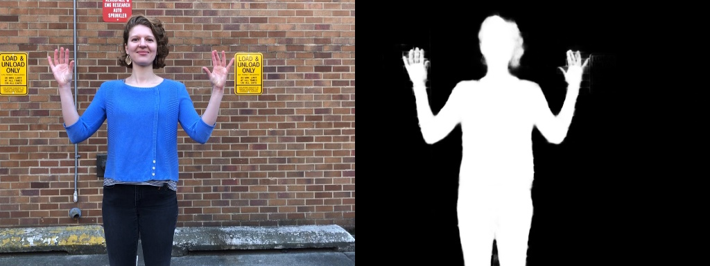

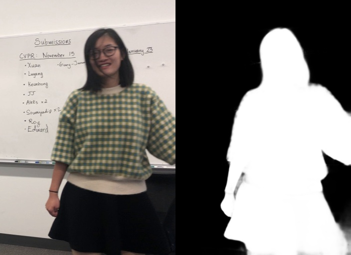

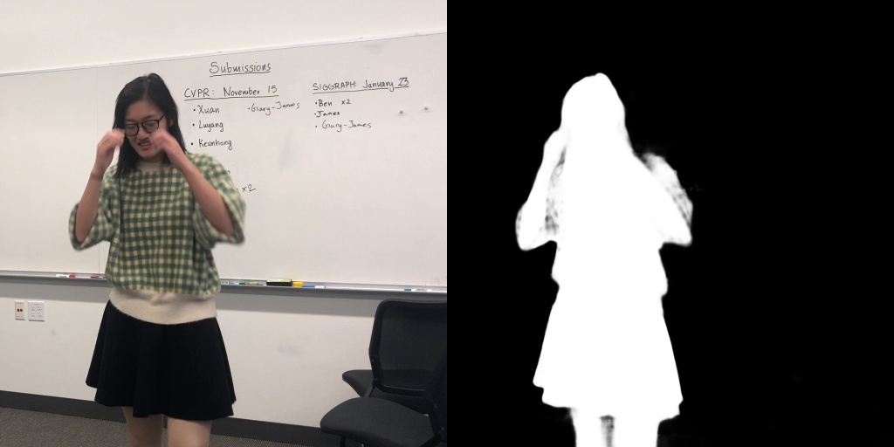

### Bad cases

We don't have back view images in our training data, thus our model cannot handle these two cases.

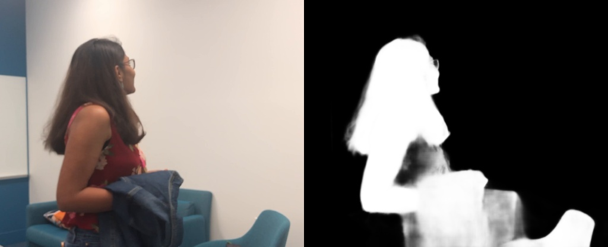

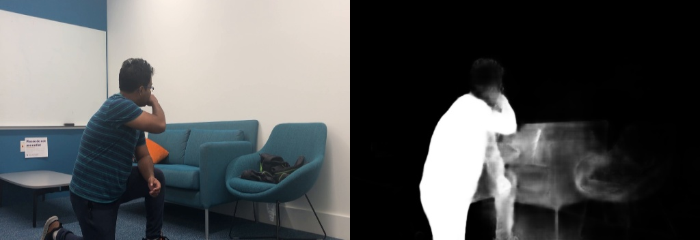

## Contact

Please contact us (yunkezhang@zju.edu.cn) using the email address assigned by your organization.